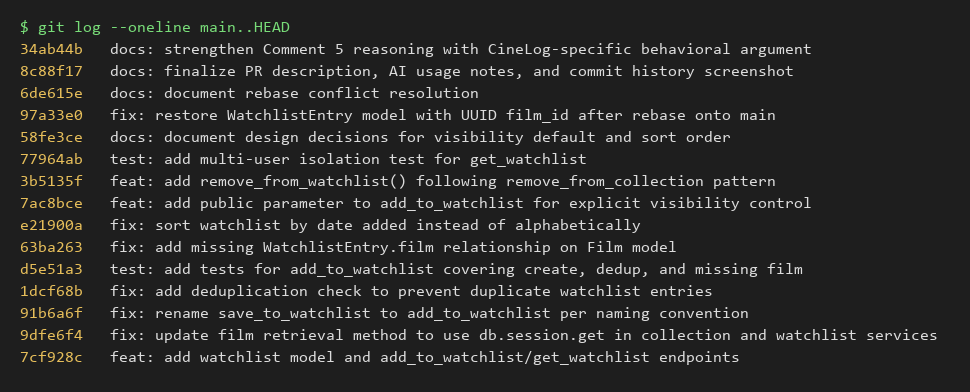

# PR Response Doc — CineLog Watchlist Feature

## AI Usage
I used Claude (via Claude Code) for orientation, hygiene, and stress-testing — not to make the two design calls themselves.

- **Orientation:** Before touching any of the six comments, I had it read `models.py`, `services/collection_service.py`, and `tests/test_collection.py` and summarize the naming convention (`verb_to_noun`), the dedup pattern (`AlreadyInCollectionError` + `filter_by(...).first()` check before insert), and the fixture structure (`app` → `sample_user`/`sample_film` → test). That's what let me write `add_to_watchlist`'s dedup check and `tests/test_watchlist.py` as a direct structural mirror instead of inventing a different pattern.
- **Stress-testing Comments 4 and 5:** After drafting my initial responses, I asked: "act as a skeptical senior reviewer — what's the strongest counterargument or overlooked tradeoff in each of these two arguments?" (full drafts pasted in). For Comment 4, it pushed back that my "consistency with `CollectionEntry`" point was weak because `CollectionEntry` has no visibility field at all — there's no actual precedent to be consistent with — and that a watchlist arguably reveals more about aspiration/intent than a collection reveals about history, which cuts toward opt-in, not opt-out. I hadn't given that asymmetry enough weight, so I rewrote the reasoning to name that as a real weakness in my own argument rather than only stating the case for `public=True`. For Comment 5, it pointed out that reframing my justification as "consistency with `get_collection()`" glosses over the fact that a collection's `date_added` (when I watched something) and a watchlist's `date_added` (when I clicked a button) don't carry the same meaning, and that the staleness problem I flagged isn't a minor edge case — it undercuts the feature's core purpose. I revised the Comment 5 response to make that tension explicit instead of mentioning it as an aside. In both cases the final position (`public=True` default; date-added sort) didn't change, but the written reasoning is more honest about what it doesn't resolve.
- **Commit hygiene:** Before finalizing, I checked my own `git log --oneline` output against the conventional commits spec (`type: description`, imperative mood, one logical change per commit) manually rather than asking an AI to do it, since the check is mechanical and I wanted to be sure I understood *why* each commit was scoped the way it was (e.g., why the UUID-relationship fix and the sort-order fix are separate commits from the original dedup/rename fixes).

## Comment 1 — Rename
**What I did:** Renamed `save_to_watchlist()` to `add_to_watchlist()` in `services/watchlist_service.py` to match the `verb_to_noun` convention used elsewhere (e.g. `add_to_collection()`), and updated the single call site in `routes/watchlist/watchlist.py` (both the import and the function call).
**How I verified:** Grepped the whole repo for `save_to_watchlist` before and after the change — one hit before (the route file), zero after. Ran `pytest tests/ -v` to confirm nothing else referenced the old name.

## Comment 2 — Deduplication
**What I did:** Followed the exact pattern in `add_to_collection()`: added an `AlreadyInWatchlistError` exception (mirroring `AlreadyInCollectionError`) and a `WatchlistEntry.query.filter_by(user_id=..., film_id=...).first()` existence check in `add_to_watchlist()` before creating the new entry. I also noticed `routes/watchlist/watchlist.py` imported `FilmNotFoundError` but never caught it — meaning a nonexistent film would 500 instead of 404. Since I was already touching the route to handle the new `AlreadyInWatchlistError` (409), I wired up both exception handlers there to match the `try/except` pattern already used in `routes/collection.py`.
**How I verified:** Ran a manual script that adds the same (user, film) pair twice through `add_to_watchlist()` directly — first call succeeds, second raises `AlreadyInWatchlistError`, confirmed only one entry model was created. Also ran `pytest tests/ -v` to confirm the existing collection tests still pass unaffected.

## Comment 3 — Missing test
**What I did:** Created `tests/test_watchlist.py`, modeled directly on `tests/test_collection.py`'s `test_add_to_collection_nonexistent_film_raises`: same `app`/`sample_user`/`sample_film` fixture trio, same in-memory SQLite setup, same fake-UUID-that-doesn't-exist approach. Added `test_add_to_watchlist_nonexistent_film_raises` as the comment specifically requested, and also added `test_add_to_watchlist_creates_entry` and `test_add_to_watchlist_duplicate_raises` so the dedup logic from Comment 2 has direct coverage too (there's no point fixing a bug in Comment 2 without a test proving it stays fixed).
**How I verified:** Ran `pytest tests/test_watchlist.py -v` (all 3 pass) and then the full suite `pytest tests/ -v` (7/7 pass, including the pre-existing collection tests) to confirm no regressions.

## Comment 4 — Default visibility
**My position:** Keep `public=True` as the default for new watchlist entries, but give callers an explicit way to opt out at creation time (implemented as the stretch feature: `add_to_watchlist(user_id, film_id, public=True)` and a `"public"` field on `POST /watchlist/<user_id>/add`).

**Reasoning:** Two pieces of evidence from the actual codebase shaped this decision, not just a general "social apps default open" instinct:

1. **There is no access-control layer yet, so `public` isn't gating anything today.** Every endpoint in this app (`/collection/<user_id>`, `/watchlist/<user_id>`) trusts whatever `user_id` is passed in the URL — there's no session/auth check that distinguishes "the owner looking at their own list" from "anyone who knows the ID." And there's no discovery/feed endpoint anywhere in the codebase that filters `WHERE public = true` to surface lists to other users. So right now, `public` is inert metadata: flipping it to `False` doesn't actually hide anything from anyone, because nothing reads it for access control yet. Given that, defaulting it to match the feature's evident intent (a shareable "here's what I want to watch" list, the same spirit as Letterboxd-style watchlists) costs nothing today and avoids having to revisit every existing row's default once a real discovery feed does read this flag.
2. **`CollectionEntry` (the sibling "already watched" feature) has no visibility concept at all** — it's implicitly fully exposed via `GET /collection/<user_id>` with zero gating. If I defaulted the *newer* feature (watchlist) to private, I'd be introducing an inconsistent privacy posture where the more sensitive-feeling data (what you've watched and rated) has no protection at all, while the less sensitive data (what you merely intend to watch) is private by default. That inconsistency would be harder to justify than picking one posture and being consistent with it.

**Tradeoff acknowledged:** The real cost of `public=True` isn't today, it's the day a discovery feed actually ships and starts reading this flag — at that point, every user who added something to their watchlist before that feature existed will have it exposed by default without ever having made that choice, and the schema has no way to tell "user consciously left this public" apart from "user never thought about it." That's a genuine "surprise exposure" risk (e.g., a birthday-surprise film, or just someone who assumed a watchlist was a personal todo list, not a public feed) — retroactive opt-in for future rows doesn't retroactively fix past ones. I also want to flag a weakness in my own reasoning above: point 2 (consistency with `CollectionEntry`) is weaker than I initially gave it credit for — `CollectionEntry` doesn't have a `public` field *at all*, so there's no existing posture to actually be consistent with; I can't point to a precedent that isn't there. And there's a real counter-case: a watchlist arguably reveals more about a person's *aspirations* (what they want, haven't done yet) than a collection reveals about their history, which if anything argues for opt-in over opt-out, not the reverse. I'm still landing on `public=True` because it's inert today and reversible per-entry via the `public` parameter, but I'm treating this as "reasonable default, revisit before any feed ships" rather than a closed case — the honest fix for the retroactive-exposure problem is product work (a migration or first-run prompt when the feed lands), not something this backend default can solve alone.

## Comment 5 — Sort order
**My position:** I implemented the maintainer's preference — `get_watchlist()` now sorts by `WatchlistEntry.date_added.desc()` instead of `Film.title.asc()` — but I want to push back on *why*, because I don't think "most users want to see what they added recently" is the strongest justification available here, and it leaves a real downside unaddressed.

**Reasoning:** There's a concrete behavioral argument for CineLog specifically, not just an abstract preference: films get added to a watchlist because of something that just happened — a friend's recommendation mid-conversation, a trailer someone just watched, finishing a director's other film in their collection and wanting more. That context is freshest in the days right after adding, which is exactly when a user is most likely to reopen their watchlist looking for "the thing I just added." Alphabetical order actively works against that — a film added five minutes ago sorts wherever its title happens to fall (e.g., a "Zodiac" added today buried below a "Alien" added eight months ago), forcing the user to scan the whole list instead of finding the thing they just committed to at the top. Date-added order matches the moment a watchlist is actually consulted.

That said, the stronger *documentation* argument (as opposed to the behavioral one above) is internal consistency: `get_collection()` in the sibling feature already sorts `CollectionEntry.date_added.desc()` (verified in `services/collection_service.py` and covered by `test_get_collection_returns_newest_first`). Watchlist and collection are the two list-shaped features in this app, presented through nearly identical `to_dict()`/route shapes. Having one sort alphabetically and the other by recency, with no documented reason for the difference, is the kind of inconsistency a new contributor (or a future me) would trip over and "fix" back to alphabetical without realizing it was deliberate.

**Engagement with reviewer's point:** Where I'd push back: pure recency has a real failure mode for a watchlist specifically (less so for a collection). A collection entry's date-added *is* meaningful — it's roughly "when I watched this," a completed, immutable fact. But a watchlist's date-added just marks "when I clicked add" on an item of *unresolved, aging intent* — the two dates don't carry the same meaning, which is a real limitation of leaning on "consistency with `get_collection()`" as my primary justification above. Under strict recency order, a film someone added eight months ago and still hasn't gotten to will sink to the bottom of the list forever, even though "the thing I've been meaning to watch for months" is arguably the most important item to resurface, not the least. That's not a cosmetic edge case — it undercuts the core job of a watchlist (help me decide what to watch next), so I don't want to wave it away as a minor follow-up. I still implemented date-added descending rather than holding up this PR for it, for a concrete reason: fixing staleness properly needs either a manual reorder/pin mechanism or a "surface old items" heuristic, both of which are new features with their own design questions (who can reorder, does pinning interact with `public`, etc.) that go well beyond what this comment asked for. Shipping date-added now, with this limitation written down, is better than either blocking on a bigger feature or silently pretending recency-only is a complete answer.

## Stretch features
- **`remove_from_watchlist(user_id, film_id)`** — added in `services/watchlist_service.py`, following `remove_from_collection()`'s pattern exactly: look up the entry by `(user_id, film_id)`, raise `NotInWatchlistError` (mirrors `NotInCollectionError`) if it doesn't exist, otherwise delete and commit. Wired to `DELETE /watchlist/<user_id>/remove` in `routes/watchlist/watchlist.py`, matching `routes/collection.py`'s `remove_film` route shape (404 on `NotInWatchlistError`). Covered by `test_remove_from_watchlist_deletes_entry` and `test_remove_from_watchlist_not_present_raises`.
- **Second test (edge case):** `test_get_watchlist_does_not_leak_other_users_entries` — adds the same film to two different users' watchlists and asserts `get_watchlist(user_a)` returns exactly one entry, not both. I chose this because every watchlist query filters by `user_id`, and that's exactly the kind of one-line `filter_by()` clause that silently disappears during a refactor (e.g., if someone later rewrites `get_watchlist` to join differently) without any existing test catching it — none of the six review comments would have caught a cross-user leak since they're all about a single user's flow.
- **Visibility toggle:** `add_to_watchlist(user_id, film_id, public=True)` and `POST /watchlist/<user_id>/add` now accept an optional `"public"` field in the request body (defaults to `True` if omitted). This is the concrete fix for the "not just inheriting a default" concern in Comment 4 — callers can now set visibility explicitly instead of always getting the default. Covered by `test_add_to_watchlist_respects_explicit_public_false`.

## Comment 6 — Rebase
**What conflicted:** Ran `git fetch origin && git rebase origin/main`. `main` had already merged `refactor: migrate film IDs from integer to UUID` (changing `Film.id` from `db.Integer` to `db.String(36)` with a UUID default) plus a later `.gitignore` commit. Two things happened during the rebase:
1. A textual conflict on `.gitignore` (add/add — both my branch and `main` added one independently before I noticed `main` already had one).
2. A silent, non-flagged conflict: git auto-applied the commit that originally added the `WatchlistEntry` model, but because `main`'s `models.py` had been substantially rewritten by the UUID refactor, the 3-way merge dropped the `WatchlistEntry` class entirely from the merged file — with no conflict markers and no error. Git only reported the `.gitignore` conflict; `git rebase` claimed full success after that. I only caught this because I ran the test suite immediately after and it failed.

**How I resolved it:**
1. Merged `.gitignore` by hand — kept both `main`'s `.pytest_cache/` entry and my `.venv/`/`venv/` entries.
2. After the rebase reported success, I ran `pytest tests/ -v` anyway (rather than trusting the "no conflicts" message) and got `ImportError: cannot import name 'WatchlistEntry' from 'models'`. I diffed `models.py` against `origin/feature/watchlist` (the pre-rebase tip, still available since I hadn't pushed yet) to confirm `WatchlistEntry` really was present before the rebase and missing after. I re-added the class to `models.py`, this time with `film_id = db.Column(db.String(36), db.ForeignKey("film.id"), nullable=False)` to match the new UUID-based `Film.id`, instead of the old `db.Integer`. I also updated the now-stale "integer — pre-refactor" docstrings and comments in `services/watchlist_service.py` and `routes/watchlist/watchlist.py` to reflect that film IDs are UUID strings, and updated the route body-shape docs (`"film_id": <int>` → `"film_id": "<uuid>"`).
3. Committed this as its own commit (`fix: restore WatchlistEntry model with UUID film_id after rebase onto main`) rather than folding it into the earlier commits, since it's a distinct, identifiable fix tied specifically to the rebase.

**How I verified no conflict remains:** `pytest tests/ -v` — all 12 tests pass (4 pre-existing collection tests + 8 watchlist tests). I also drove the actual Flask endpoints end-to-end with a throwaway script using `app.test_client()`: created a user and film with real UUID primary keys, then hit `POST /watchlist/<user_id>/add`, a duplicate add (409), `GET /watchlist/<user_id>`, `DELETE /watchlist/<user_id>/remove`, a second remove (404), and an add against a nonexistent UUID (404) — every response had the UUID string flowing through correctly with no type errors. Finally, `git log --oneline --merges main..feature/watchlist` returns empty, confirming the branch is a clean rebase with no merge commits.

## Commit History

`git log --oneline main..HEAD` on `feature/watchlist` after the interactive rebase — 13 commits, all conventional format, no merge commits:



## PR Description

**What this feature does:** Adds a watchlist feature to CineLog so users can save films they want to watch later, separate from their collection of already-watched films. Adds a `WatchlistEntry` model and three endpoints:
- `GET /watchlist/<user_id>` — list a user's watchlist, sorted by date added (newest first)
- `POST /watchlist/<user_id>/add` — add a film to the watchlist, with duplicate protection and an optional `public` flag (defaults to `True`)
- `DELETE /watchlist/<user_id>/remove` — remove a film from the watchlist (stretch feature)

**Design decisions:**
1. **Default visibility (`public=True`):** New watchlist entries default to public, matching the app's existing fully-open posture (the sibling `CollectionEntry` feature has no visibility gating at all) and the fact that nothing in the codebase yet reads this flag for access control — there's no discovery feed or auth layer today, so the default costs nothing now. Callers can override it via the new `public` parameter on `add_to_watchlist()` / request body. Full reasoning and the tradeoffs I'm not solving here (retroactive exposure once a discovery feed ships) are in Comment 4 below.
2. **Sort order (date added, newest first):** Changed from alphabetical-by-title to `date_added` descending, matching `get_collection()`'s existing convention. Full reasoning, including a pushback on the "most users want recency" justification and an acknowledged limitation (stale watchlist items sink to the bottom), is in Comment 5 below.

**How to manually test:**
```bash
python -m venv .venv && source .venv/Scripts/activate   # or .venv\Scripts\activate.bat on Windows cmd
pip install -r requirements.txt
python app.py   # starts on http://127.0.0.1:5000
```
Then, in another terminal (replace `<user_id>` / `<film_id>` with real UUIDs from your seeded data, e.g. via `GET /films`):
```bash
# View a user's watchlist (empty at first)
curl http://127.0.0.1:5000/watchlist/<user_id>

# Add a film (defaults to public)
curl -X POST http://127.0.0.1:5000/watchlist/<user_id>/add \
  -H "Content-Type: application/json" \
  -d '{"film_id": "<film_id>"}'

# Add the same film again -> 409 AlreadyInWatchlistError
curl -X POST http://127.0.0.1:5000/watchlist/<user_id>/add \
  -H "Content-Type: application/json" \
  -d '{"film_id": "<film_id>"}'

# Add a film with explicit private visibility
curl -X POST http://127.0.0.1:5000/watchlist/<user_id>/add \
  -H "Content-Type: application/json" \
  -d '{"film_id": "<other_film_id>", "public": false}'

# View the watchlist again -> newest-added film first
curl http://127.0.0.1:5000/watchlist/<user_id>

# Remove a film -> 200, then remove again -> 404 NotInWatchlistError
curl -X DELETE http://127.0.0.1:5000/watchlist/<user_id>/remove \
  -H "Content-Type: application/json" \
  -d '{"film_id": "<film_id>"}'

# Add a nonexistent film_id -> 404 FilmNotFoundError
curl -X POST http://127.0.0.1:5000/watchlist/<user_id>/add \
  -H "Content-Type: application/json" \
  -d '{"film_id": "00000000-0000-0000-0000-000000000000"}'
```
Or run the automated suite: `pytest tests/ -v` (12 tests covering both `collection` and `watchlist`).
